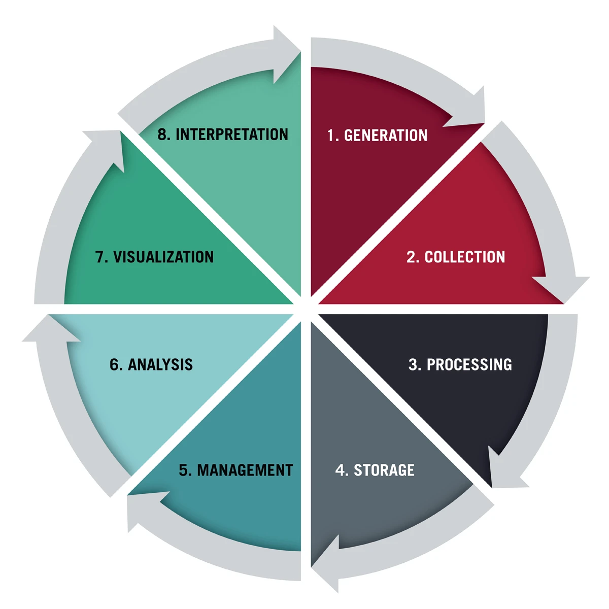

# 1.1. Vòng đời dữ liệu (Data Lifecycle)

> **Cấp độ:** 🌱 [Fresher]
> **Mục tiêu:** Hiểu rõ con đường dữ liệu đi từ lúc sinh ra cho đến khi mang lại giá trị thực tế. Nắm bắt 8 giai đoạn cốt lõi (dựa trên mô hình của Harvard Business School), từ đó định vị chính xác vùng trách nhiệm của một Data Engineer.

Dữ liệu không tự nhiên sinh ra ở dạng hoàn chỉnh và sẵn sàng cho việc phân tích. Nó là một luồng thông tin vận động liên tục qua nhiều hệ thống khác nhau. Theo chuẩn của HBS, quá trình này được chia thành 8 bước tuần tự. Kết quả của bước cuối cùng thường quay lại tác động đến hệ thống, tạo ra những tương tác mới và khởi động lại bước đầu tiên, hình thành nên một vòng lặp không ngừng.

### 1. Sinh ra dữ liệu (Generation)

Mọi luồng dữ liệu đều phải có một điểm bắt đầu. Giai đoạn này xảy ra mỗi khi có một tương tác, một sự kiện hoặc một giao dịch mới diễn ra.

- **Hành động thực tế:** Người dùng thao tác trên giao diện Frontend (như ReactJS), hoặc các hệ thống Backend (như Java Spring Boot) xử lý logic và sinh ra một bản ghi mới.
- **Nơi lưu vết:** Các cơ sở dữ liệu vận hành (OLTP) như PostgreSQL, MySQL hoặc các file log của hệ thống máy chủ.

### 2. Thu thập (Collection)

Dữ liệu vừa sinh ra nằm rải rác ở nhiều nơi, nhiều hệ thống khác nhau và cần được gom về một mối một cách an toàn. Đây là nơi hệ thống Data Engineering bắt đầu lên tiếng.

- **Nhiệm vụ:** Trích xuất (Extract) dữ liệu mà không làm ảnh hưởng (giảm hiệu năng, khóa bảng) đến các hệ thống nguồn đang phục vụ người dùng.
- **Thực tiễn:** Thay vì truy vấn trực tiếp vào database nguồn, kỹ sư dữ liệu thường bắt luồng thay đổi (CDC - Change Data Capture) bằng các công cụ như Debezium, sau đó đẩy dữ liệu dạng sự kiện (events) vào các hệ thống Message Broker như Apache Kafka.

### 3. Xử lý (Processing)

Dữ liệu vừa thu thập về (Raw Data) thường có định dạng không đồng nhất, thiếu sót, sai lệch hoặc chứa những thông tin nhạy cảm cần che giấu.

- **Nhiệm vụ:** Làm sạch (Cleaning), chuẩn hóa, lọc và biến đổi (Transform) dữ liệu thô thành định dạng cấu trúc, có ý nghĩa.
- **Thực tiễn:** Các động cơ tính toán phân tán mạnh mẽ như Apache Spark (cho xử lý lô/batch) hoặc Apache Flink (cho xử lý luồng/streaming) sẽ nhận nhiệm vụ nhào nặn khối dữ liệu này.

### 4. Lưu trữ (Storage)

Khi dữ liệu đã được thu thập hoặc xử lý, nó cần một "bến đỗ" có khả năng mở rộng tốt (scalable) và tối ưu về mặt chi phí.

- **Nhiệm vụ:** Thiết kế cấu trúc lưu trữ phân tầng. Dữ liệu thô thường được đổ vào Data Lake (ví dụ: MinIO, S3), trong khi dữ liệu đã qua xử lý được tổ chức lại gọn gàng tại Data Warehouse.
- **Thực tiễn:** Dữ liệu sẽ được chuyển đổi sang các định dạng lưu trữ dạng cột (Columnar format) như Parquet hay ORC để tối ưu hóa tốc độ đọc.

### 5. Quản lý (Management)

Khác với việc chỉ "lưu trữ", quản lý (Management) là bước biến một đống dữ liệu khổng lồ thành một tài sản có thể kiểm soát. Đây là bước phân biệt một nền tảng dữ liệu chuẩn chỉnh với một "đầm lầy dữ liệu" (Data Swamp).

- **Nhiệm vụ:** Xây dựng từ điển dữ liệu (Data Catalog), theo dõi dòng chảy dữ liệu (Data Lineage) để biết dữ liệu sinh ra từ đâu và bị biến đổi thế nào.
- **Bảo mật:** Quản lý định danh và phân quyền truy cập (AuthN/AuthZ) chi tiết. Việc tích hợp các giải pháp như Keycloak để xác thực người/hệ thống nào được phép truy cập vào luồng dữ liệu nào là đặc biệt quan trọng.

### 6. Phân tích (Analysis)

Dữ liệu sạch sẽ, an toàn và được phân loại kỹ càng giờ đây sẽ được đưa vào sử dụng để trả lời các câu hỏi nghiệp vụ.

- **Nhiệm vụ:** Chạy các truy vấn phức tạp (Heavy Queries) trên hàng tỷ dòng dữ liệu, tìm kiếm xu hướng, hoặc đào tạo các mô hình Học máy (Machine Learning).
- **Thực tiễn:** Đòi hỏi các động cơ truy vấn phân tán siêu tốc (MPP) như StarRocks hoặc Trino để truy xuất khối lượng dữ liệu khổng lồ trong thời gian tính bằng giây.

### 7. Trực quan hóa (Visualization)

Những bảng dữ liệu với hàng triệu con số khô khan cần được chuyển đổi thành định dạng mà con người (những người không chuyên về kỹ thuật) có thể hiểu ngay lập tức.

- **Nhiệm vụ:** Biểu diễn dữ liệu qua các biểu đồ, đồ thị, dashboard.
- **Thiết kế phân phối (Dispatching):** Ngoài các công cụ BI nội bộ (như Metabase, Superset), dữ liệu có thể được đóng gói và định tuyến qua các API Gateway (như Kong) để phục vụ trực tiếp ngược lại lên màn hình giao diện của người dùng cuối.

### 8. Diễn giải & Ra quyết định (Interpretation)

Đích đến cuối cùng và là giá trị cốt lõi của toàn bộ vòng đời.

- **Nhiệm vụ:** Dựa trên các báo cáo và biểu đồ, đội ngũ nghiệp vụ rút ra các insight, giải thích nguyên nhân đằng sau các con số và đưa ra quyết định kinh doanh hoặc điều chỉnh tính năng hệ thống.
- **Vòng lặp:** Những quyết định này dẫn đến sự thay đổi trong hệ thống hoặc quy trình thực tế, từ đó tạo ra những hành vi mới của người dùng và hệ thống, chính thức kích hoạt lại **Bước 1 (Generation)**.

---

**Tóm lại:** Dưới lăng kính của HBS, trọng tâm chuyên môn của một Data Engineer (Kỹ sư dữ liệu) là thiết kế, xây dựng và tối ưu hóa hạ tầng từ **Bước 2 (Thu thập)** đến **Bước 5 (Quản lý)**, cung cấp hệ thống lưu trữ/truy vấn cho **Bước 6 (Phân tích)**. Bạn tạo ra một đường ống vững chắc để các Data Analyst (DA), Data Scientist (DS) và Business Users tỏa sáng ở những chặng cuối cùng của vòng đời.
